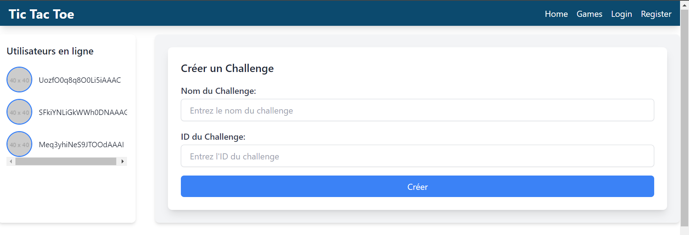

# Jeu de Tic Tac Toe

## Capture d'écran

### Page d'accueil

### Page de jeu

## Description

Un jeu de Tic Tac Toe en ligne développé avec **Express.js** et **WebSockets**, permettant des parties en temps réel. Le site comporte quatre pages principales : Accueil, Jeu, Connexion, et Inscription.

## Fonctionnalités

- Jouez contre un autre joueur en ligne.
- Interface utilisateur simple et intuitive.
- Déploiement sur [Render](https://tictac-nl2r.onrender.com/).

## Technologies utilisées

-   
  Utilisé pour créer le backend de l'application et gérer les requêtes HTTP.

-   
  Permet la communication en temps réel entre les joueurs.

-   
  Structure des pages web.

-   
  Stylise les pages web pour une meilleure interface utilisateur.

-   
  Ajoute de l'interactivité aux pages web et gère la logique de jeu.

## Installation

1. Clonez ce dépôt.
2. Installez les dépendances avec `npm install`.
3. Lancez le serveur avec `npm start`.

## Utilisation

1. Inscrivez-vous ou connectez-vous.
2. Commencez une partie en ligne et essayez d'aligner 5 symboles.

## Contribuer

Les contributions sont les bienvenues ! Veuillez soumettre des pull requests.

## Licence

Ce projet est sous licence MIT.
